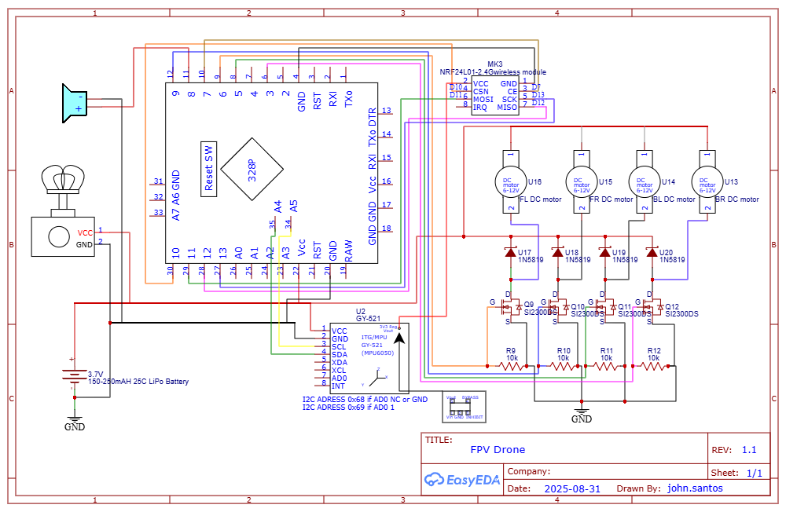
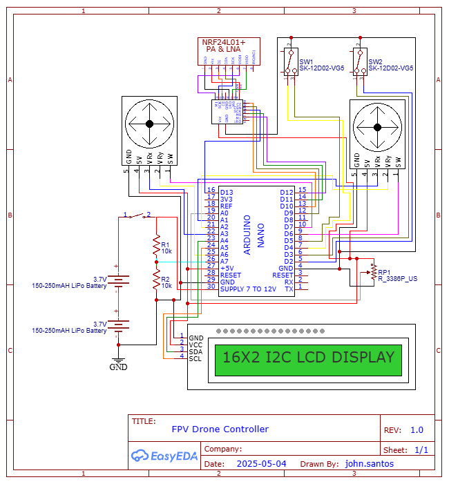
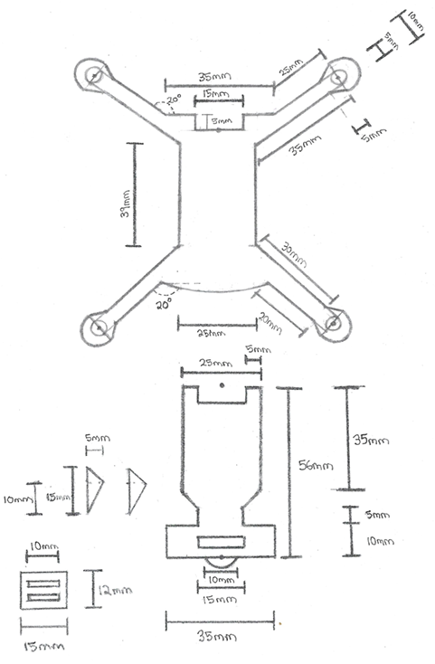

# NRF24-MultiWii-Drone

This repository contains both software and electrical components for building a drone using the NRF24L01 radio modules and Arduino.


# Changelog

* Jun 08, 2025 [v1.0]: Prototype 1.0 [Fail] - Zero communication between controller and the drone.
* Jul 22, 2025 [v1.1]: Prototype 1.1 [Fail] - Drone short circuited with carbon fiber frame. 
* Aug 18, 2025 [v1.2]: Prototype 1.2 [Fail] - Drone keeps resetting.
* Aug 31, 2025 [v1.3]: [Prototype 1.3](https://youtu.be/l2KEjdwurtw?si=Yr7yQo37yw-8ZKtF) [Fail] - Drone does not lift off, motors out of sync. 

# Schematics and Diagrams

The following schematic diagram shows the wiring components and hardware for the drone.



The following schematic diagram shows the wiring components and hardware for the drone controller. 



The following cutout shows the parts needed to build the frame for the drone. The PDF version of this blueprint can be found and printed under `docs/assets/carbon-fiber-blueprint-drone-frame.pdf`.



The tutorial for building and assembling the drone can be found under `\docs`.

# Documentation

The documentation that provides more details and tutorials on building the drone can be found under `\docs`. 

To generate the documentation using `sphinx`, follow the tutorial below with the command line. 

```shell
cd docs
```

```shell
pip install -r requirements.txt
```

```shell
make clean
make html
```

```shell
sudo apt-get install latexmk
sudo apt-get install texlive-fonts-recommended
sudo apt-get install texlive-latex-extra
```

```shell
make latexpdf
```

# Credits

Original drone software is credited to [iforce2d](https://www.youtube.com/@iforce2d).

## Drone Tutorial - Max Imagination

[](https://www.youtube.com/watch?v=Sa6EslOHsI0)

* [Elektor Labs blog post](https://www.elektormagazine.com/labs/make-a-tiny-arduino-drone-with-fpv-camera)
* [Project Files](https://drive.google.com/drive/folders/1mWTCPN2daOcmTa4wUF0j8qPXhXvxLfkK)

## Drone Tutorial - ElectroNoobs

[](https://www.youtube.com/watch?v=J0x4ChjUS00&t=719s)

