# NRF24-MultiWii-Drone

This repository contains both software and electrical components for building a drone using the NRF24L01 radio modules and Arduino.

[EasyEDA Project](https://oshwlab.com/john.santos/multiwii-arduino-drone-project)

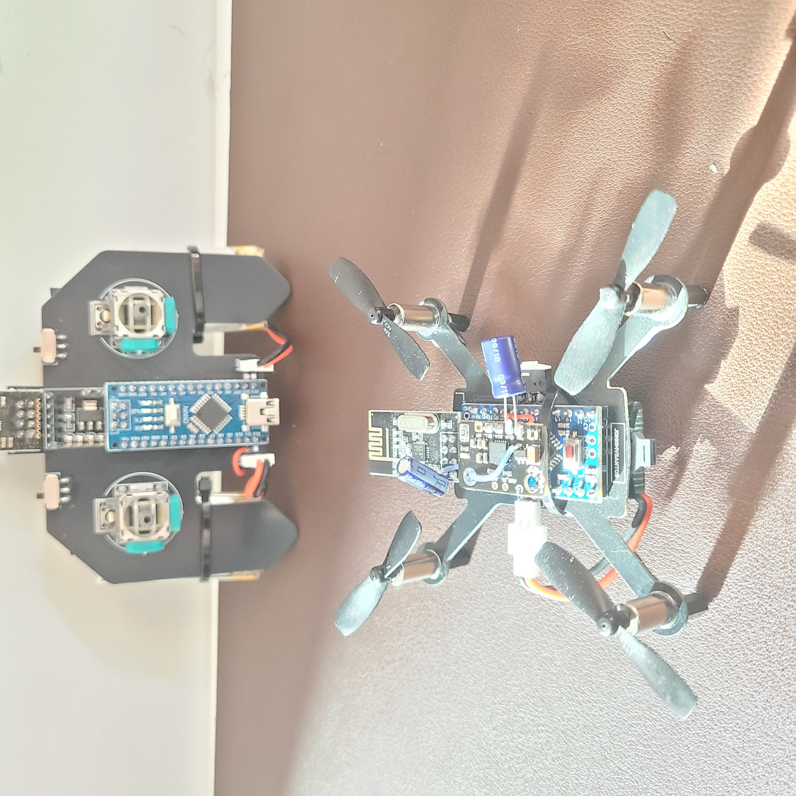

# Changelog

* Jun 08, 2025 [v1.0]: Prototype 1.0 [Fail] - Zero communication between controller and the drone.
* Jul 22, 2025 [v1.1]: Prototype 1.1 [Fail] - Drone short circuited with carbon fiber frame. 
* Aug 18, 2025 [v1.2]: Prototype 1.2 [Fail] - Drone keeps resetting.
* Aug 31, 2025 [v1.3]: [Prototype 1.3](https://youtu.be/l2KEjdwurtw?si=Yr7yQo37yw-8ZKtF) [Fail] - Drone does not lift off, motors out of sync. 
* Nov 30, 2025 [v1.4]: [Prototype 1.4](https://youtu.be/Q8TK0ZtKbdI?si=oR4hcLkOsZyx9zIT) [Fail] - Drone does not lift, too heavy, joystick movements does not match MultiWii simulation and drone output behaviour.
* Jan 31, 2026 [v1.5]: [Prototype 1.5](https://youtu.be/-AvNgkW_3SQ?si=GbaD0aLfVKiBPiV2) [Fail] - Drone does not lift, keeps resetting, joystick movements does not match flight pattern
* Mar 28, 2026 [v2.0]: [Prototype 2.0](https://youtu.be/SzuUDoo7Tts) [Fail] - Converted drone to a PCB, but still does not lift, one motor draws most of the power. Power to the components is not well regulated.
* Apr 27, 2026 [v2.1]: [Prototype 2.1](https://youtu.be/SVGbemywxcY) [Pass] - PCB adjustments to reduce EMF effects and better weight distributions; software adjustments for correct motor mapping.

# Schematics and Diagrams

The following schematic diagram shows the wiring components and hardware for the drone.

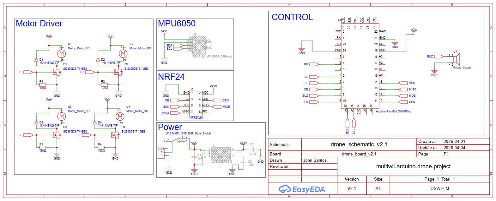

| Drone PCB        | Drone 3D View |
|------------------|---------------|
| 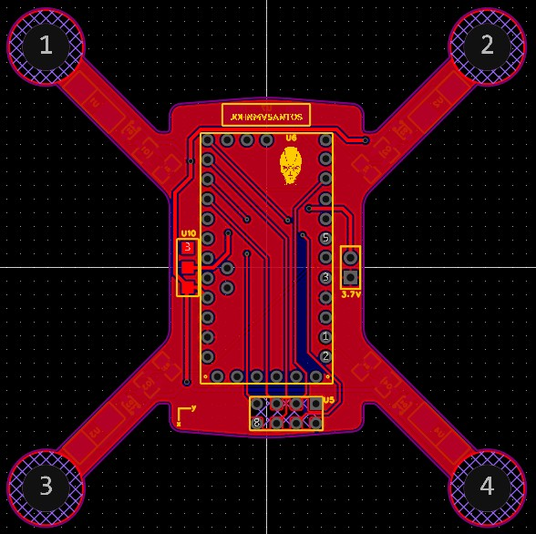 | 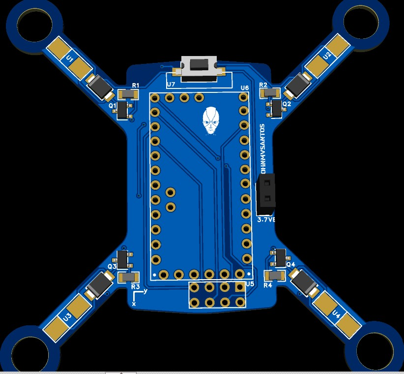 |

The following schematic diagram shows the wiring components and hardware for the drone controller. 

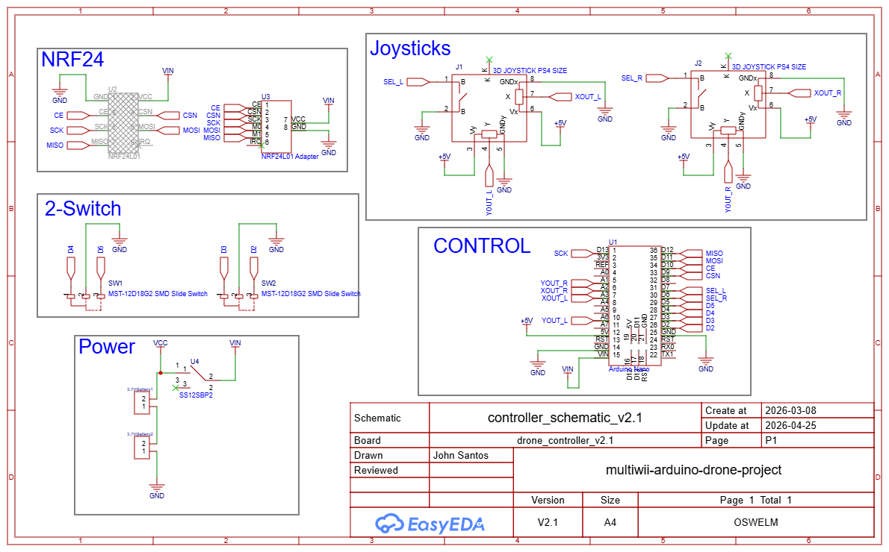

| Controller PCB   | Controller 3D View |
|------------------|--------------------|
| 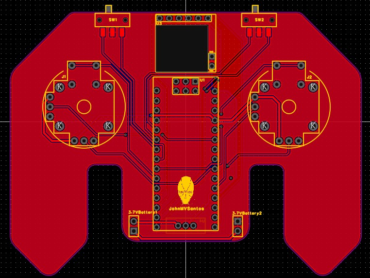 | 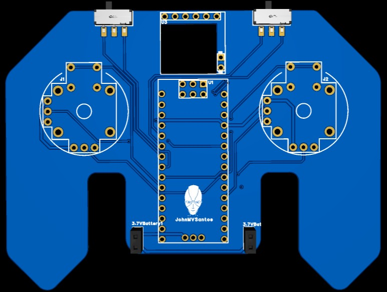 |

The following DXF sketch cutout of the drone can be found under `design_files/drone_sketch.dxf`.

| Drone Frame Sketch | Drone Frame Body |
|--------------------|------------------|
| 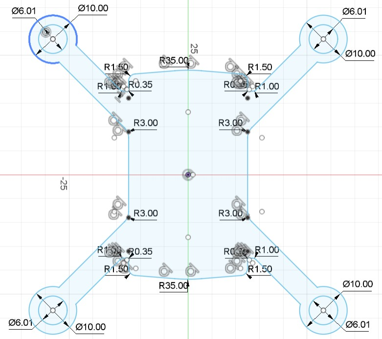 | 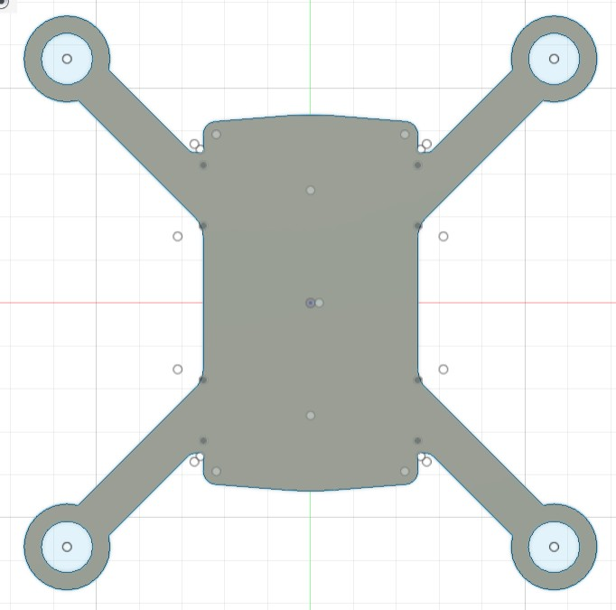 |

The following DXF sketch cutout of the controller can be found under `design_files/controller_sketch.dxf`.

| Controller Frame Sketch | Controller Frame Body |
|-------------------------|-----------------------|
| 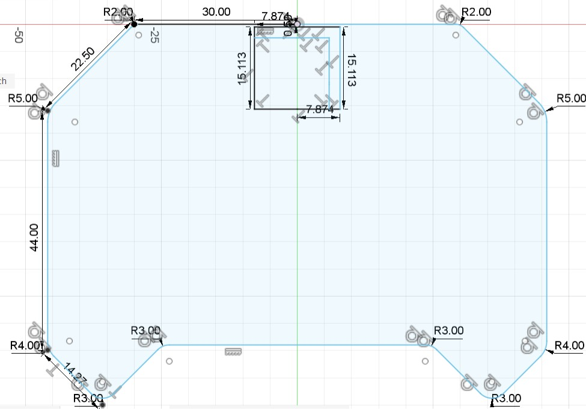 | 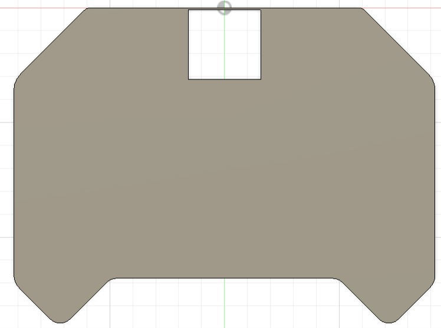

The tutorial for building and assembling the drone can be found under `\docs`.

# Documentation

The documentation that provides more details and tutorials on building the drone can be found under `\docs`. 

To generate the documentation using `sphinx`, follow the tutorial below with the command line. 

```shell
cd docs
```

```shell
pip install -r requirements.txt
```

```shell
make clean
make html
```

```shell
sudo apt-get install latexmk
sudo apt-get install texlive-fonts-recommended
sudo apt-get install texlive-latex-extra
```

```shell
make latexpdf
```

# Key Learnings/Takeaways

## Design Considerations:

1. Battery 25C works for this drone
2. 5V 16MHz Arduino Pro Mini is sufficient for the drone
3. Copper EMF blocking shield helps reduce the EMF noise generated by the motor driver
4. Better to place MPU6050 away from electrical noise of the Arduino and other electrical components
5. The IMU needs to be sitting flat and secured properly to prevent wobbling
6. Capacitors helps reduce power fluctuations and noise
7. Position all 4 motors evenly and in the same manner. The start rotation should be consistent
8. Smaller surface area can cause instability? I think it is better for longer arms and larger propellers to increase the drone surface area - larger lift
9. Thicker drone arms that doesn't bend is better for stability. The overall surface area of the arms and propeller should be maximized
10. Choose your components based on the design specifications. These are the components I have chosen based on the design specifications
    - 10KOhm resistor 0805 (0.125W) [CRG0805F10K](https://www.digikey.ca/en/products/detail/te-connectivity-passive-product/CRG0805F10K/2380831)
        * Ensures VGS = 0
    - Diode: [SS54FSH](https://www.digikey.ca/en/products/detail/taiwan-semiconductor-corporation/SS54FSH/18718584) (5A, 40V)
        * Maximum rated current must be greater than 2 * stall current (assuming 2-6A)
    - N- Channel Mosfet: [AO3400A](https://www.digikey.ca/en/products/detail/alpha-omega-semiconductor-inc/AO3400A/1855772) or [AO3416](https://www.digikey.ca/en/products/detail/alpha-omega-semiconductor-inc/AO3416/1855783)
        * VDS ~>20-30V is better (rated for high voltage spikes)
        * RDS ~<10mOhm is better (low power loss)
        * Gate threshold ~2.5-3.3V (turns on based on battery capacity)
        * Continuous & Pulsed Current Rating should exceed peak and continuous current draw in drone (5.5A = 25C * 0.22Ah).

1. Use an oscilloscope to check the PWM signals from the motor gates to see if it is causing sync issues with the motors - ensure consistent PWM frequency across all four motors

2. Test n-channel mosfet Integrity and ensure drain voltage approaches zero as gate voltage increases

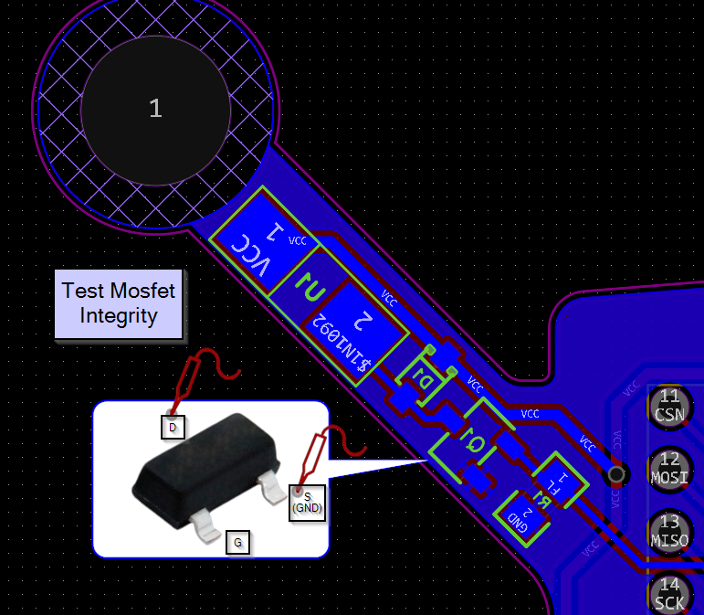

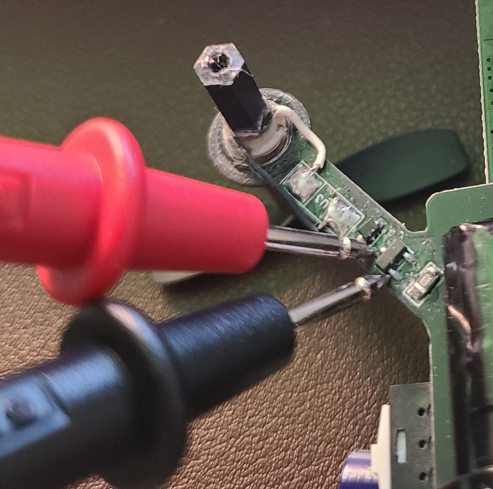

3. Test Motor terminals if voltage is received

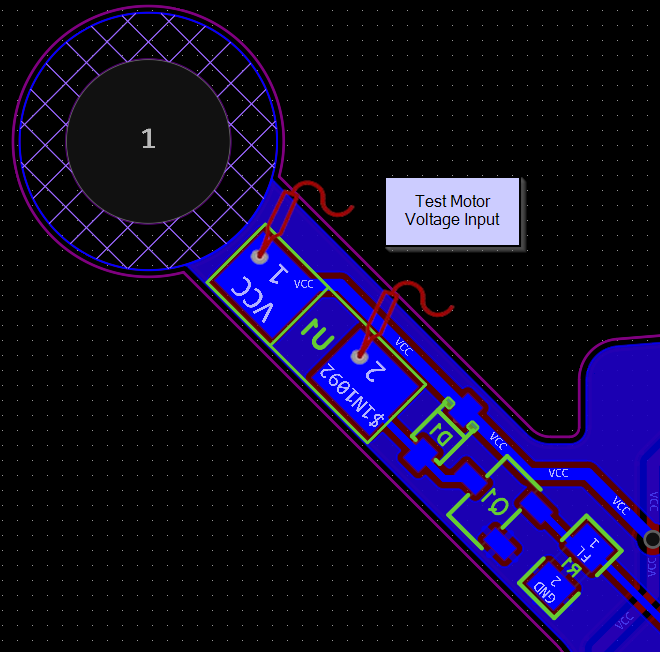

## Practical Considerations

1. Check NRF24 radio communication first before assembling the drone. Always test parts individually
2. Keep it simple and complexity should not come first. Achieve minimum functionality for initial developments
3. Better to use solder with lead, but prone to contamination (ensure proper storage)
4. Thin kapton tapes do not provide as much insulation as actual electrical tape. Though electrical tape is heavier
5. Ensure the motor power can carry the total load of the drone
6. Ensure prototype works before designing a final PCB

# Successful Vendors

These are the lift of successful vendors that sold the components needed for this project that worked. 

- **Robojax**: Arduino Pro Mini 5V 16MHz 
- **HiLetGo**: NRF24L01+PA+LNA Transeiver Module
- **Aideepen**: NRF24L01 Transeiver Standard Module
- **Aideepen**: Arduino Nano Board
- **Fytoo**: 3.7V 600mAH LiON batteries - used for the controller
- **Fytoo**: 3.7V 220mAH LiON 25C battery
- **WWZMDiB**: Mini USB to TTL Serial Converter Adapter, 3.3V/5.5 V FTDI Breakout Board for Arduino
- **Wishiot**: Thumb Joystick Module Dual Axis Sensor for Arduino
- **DFRobot**: MPU6050 Gyro + Accelerometer Module
- **Digikey**: Surface mount components (resistors, diodes, n-channel MOSFETs, capacitors, etc)
- **Midzooparts**: Lilypad Buzzer Small Speaker Module for Arduino
- **Crazepony**: 4pcs 6x15mm Motor (Speed: Insane) 19000KV, 70000 RPM@3.7V

These are the list of vendors that sold components that did not work or were faulty for this project.

- **Hutomwua**: Arduino Pro Mini 5V 16MHz (Did not meet specifications or seems to be 10MHz on the backside - not advertised)
- **ELEGOO**: Arduno Nano (Faulty and did not program)
- **Fytoo**: 3.7V 1000mAH LiON batteries (potentially drew too much current and burned the board?)
- **Aideepen**: NRF24L01+PA+LNA Transeiver Module (Faulty and did not communicate)

# Future Work

## v3.0
- If it doesn't fly (use Arduino Nano board and standard MPU6050? This requires regulators since Arduino Nano inputs 5V)
- Incorporatte FPV camera - make it see
- Add AI detections and features

## v4.0
- Custom FPV GUI with IMU readings (Can a single transmitter have two recievers (Controller + GUI)? )

# Credits

Original drone software is credited to [iforce2d](https://www.youtube.com/@iforce2d).

## Drone Tutorial - Max Imagination

[](https://www.youtube.com/watch?v=Sa6EslOHsI0)

* [Elektor Labs blog post](https://www.elektormagazine.com/labs/make-a-tiny-arduino-drone-with-fpv-camera)
* [Project Files](https://drive.google.com/drive/folders/1mWTCPN2daOcmTa4wUF0j8qPXhXvxLfkK)

## Drone Tutorial - ElectroNoobs

[](https://www.youtube.com/watch?v=J0x4ChjUS00&t=719s)

# Support Forums

* https://www.instructables.com/Make-a-Tiny-Arduino-Drone-With-FPV-Camera/
* https://www.elektormagazine.com/labs/make-a-tiny-arduino-drone-with-fpv-camera
