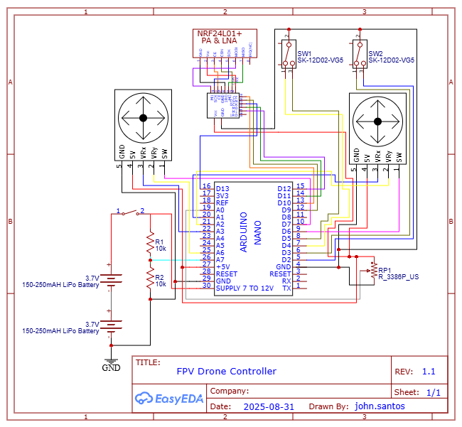

.. _controller_tutorial:

Controller Tutorial
====================

This page will show the step-by-step tutorial for building the NRF24 MultiWii Drone Controller.

Materials
##########

1. Arduino Nano Atmega328P 3V (x1)
2. NRF24L01+PA+LNA Transceiver Module with 8-pin Breakout Adapters (x1)
3. Joystick Module for Arduino Dual Axis Sensor (x2)
4. 3-pin Switch (x2)
5. 100KOhm Potentiometer (x1)
6. Power Switch (x1)
7. Power Connector (x1)
8. Charging Connector (x1)
9. 3.7V LiPO Battery 600mAH (x2)

Frame
#######

The controller frame is from an `RC 3 wheel stunt car <https://www.mindgames.ca/rc-sinovan-3-wheel-stunt-car-2-4g-mutilcolor/>`_ which was modified 
to fit the electrical components of this drone controller. 

.. list-table::
   :widths: 50 50
   :header-rows: 0

   * - .. image:: assets/rc-stunt-car-controller.png
         :width: 300px
         :alt: RC Stunt Car Controller
     - .. image:: assets/assembled-drone-controller.jpg
         :width: 300px
         :alt: Assembled Drone Controller

Electrical
#############

1. Assemble and solder the electrical components based on this schematic diagram.

2. The assembled controller circuit should look like the following.

Software
##########

1. Open the Arduino IDE and open the project `MultiWii_RF24`.

2. Install the following libraries and include the ZIP libraries in the Arduino IDE.

* `RF24 <https://electronoobs.com/eng_arduino_NRF24_lib.php>`_
* `TimerFreeTone_v1.5 <https://bitbucket.org/teckel12/arduino-timer-free-tone/downloads/TimerFreeTone_v1.5.zip>`_

3. Adjust the upload settings in Arduino under Tools to set the right board "Arduino Pro or Pro Mini", the COM Port, and the processor to "ATmega328P (5V, 16MHz)".

