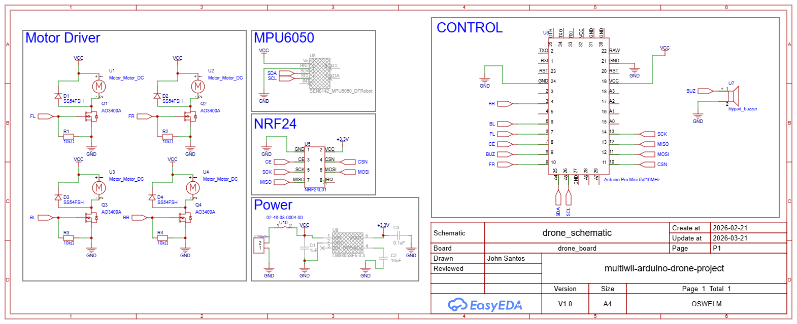
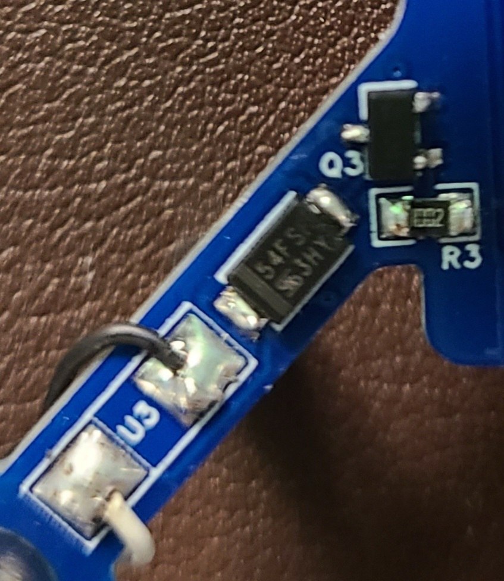
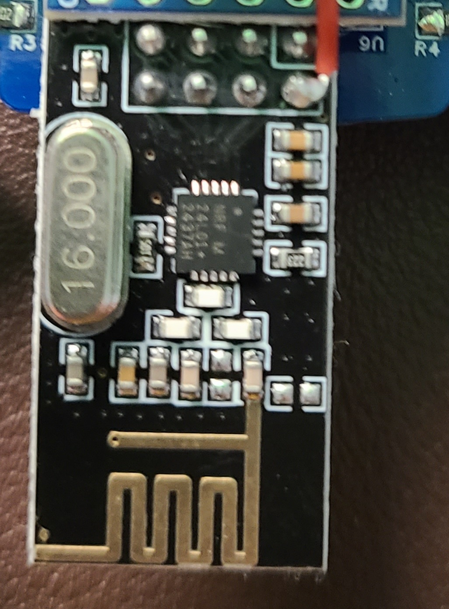
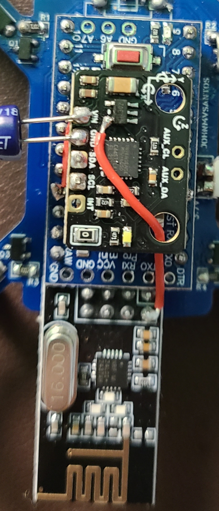
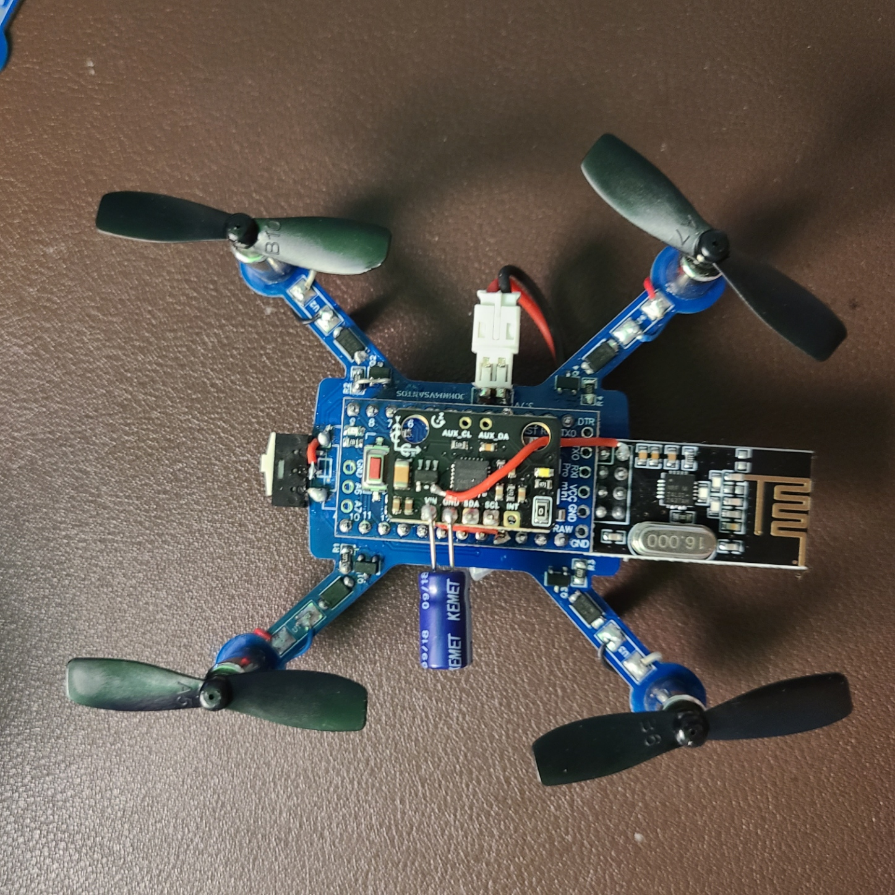
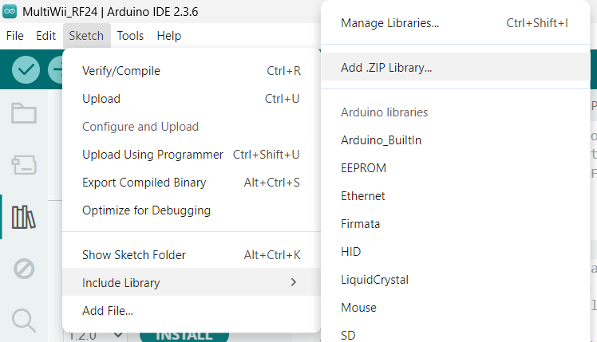
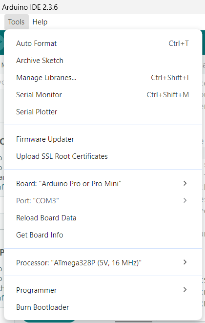
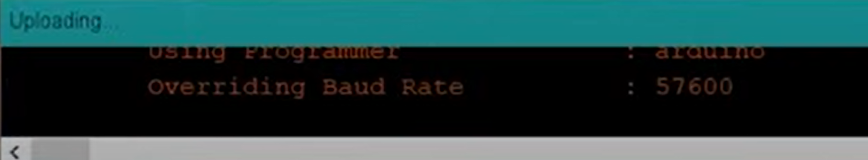

.. _drone_tutorial:

Drone Tutorial
===============

This page will show the step-by-step tutorial for building the NRF24 MultiWii Drone.

Materials
##########

1. Arduino Pro Mini Atmega328P 5V/16MHz (x1)
2. MPU6050 Gyroscope/Accelerometer from DFRobot (SEN0142) (x1)
3. NRF24L01+ Transceiver Module (x1)
4. Lilypad 5V Buzzer Speaker (x1)
5. Micro 600TVL FPV Camera with 5.8GHz 25mW Transmitter (x1)
6. 6x15mm 0.8mm Shaft Coreless Motors 19000KV (x4)
7. `SS54FSH <https://www.digikey.ca/en/products/detail/taiwan-semiconductor-corporation/SS54FSH/18718584>`_ Surface Mount Diode (x4)
8. `AO3400A <https://www.digikey.ca/en/products/detail/alpha-omega-semiconductor-inc/AO3400A/1855772>`_ Surface Mount N-Channel MOSFET (x4)
9. `CRG0805F10K <https://www.digikey.ca/en/products/detail/te-connectivity-passive-product/CRG0805F10K/2380831>`_ 10KOhm Surface Mount Resistor (x4)
10. 2 Blade 37mm Propellers (x4)
11. LiPO Battery 3.7 220mAH (25C) + charger + JST Battery Connector (x1)

Common
---------

1. 30AWG Wires
2. Super Glue
3. Soldering Iron and Solder
4. Mini USB to TTL Serial Converter Adaptor
5. M2 Nylon Hex Spacer Standoff Kit with Male and Female Screw Nut etc.
6. FPV Goggles

Hardware
#############

1. Take the Gerber files for the drone PCB and upload them to JLCPCB to manufacture the PCB. The Gerber file can be found in the `design_files/Gerber_Drone_PCB_2026-03-27.zip` 

2. The drone PCB is based off the following schematic.

3. The PCB should appear as the following when it is received.

.. image:: assets/drone_pcb.png
   :width: 600px
   :align: center
   :alt: Drone PCB

4. Assemble and solder the motor driver of the drone along the arms with 10KOhm resistor 0805, SS54FSH surface mount diodes, and AO3400A N-channel Mosfets.

5. Solder the NRF24L01+ Transceiver Module.

6. Solder the switch and the buzzer to the PCB.

.. list-table::
   :widths: 50 50
   :header-rows: 0

   * - .. image:: assets/drone_switch_connection.jpg
         :width: 300px
         :alt: Switch Connection
     - .. image:: assets/drone_buzzer_connection.jpg
         :width: 300px
         :alt: Buzzer Connection

7. Solder the Arduino Pro Mini to the PCB.

8. Solder the MPU6050 on top of the Arduino Pro Mini. Solder the power connections of the MPU6050 and the NRF24L01.

9. The final assembled drone should look like the following.

Software
##########

1. Open the Arduino IDE and open the project `MultiWii_RF24`.

2. Install the following libraries and include the ZIP libraries in the Arduino IDE.

* `RF24 <https://electronoobs.com/eng_arduino_NRF24_lib.php>`_
* `TimerFreeTone_v1.5 <https://bitbucket.org/teckel12/arduino-timer-free-tone/downloads/TimerFreeTone_v1.5.zip>`_

3. Adjust the upload settings in Arduino under Tools to set the right board "Arduino Pro or Pro Mini", the COM Port, and the processor to "ATmega328P (5V, 16MHz)".

4. Upload the software to the Arduino. Ensure to reset the Arduino once the programming stage reaches this state.

