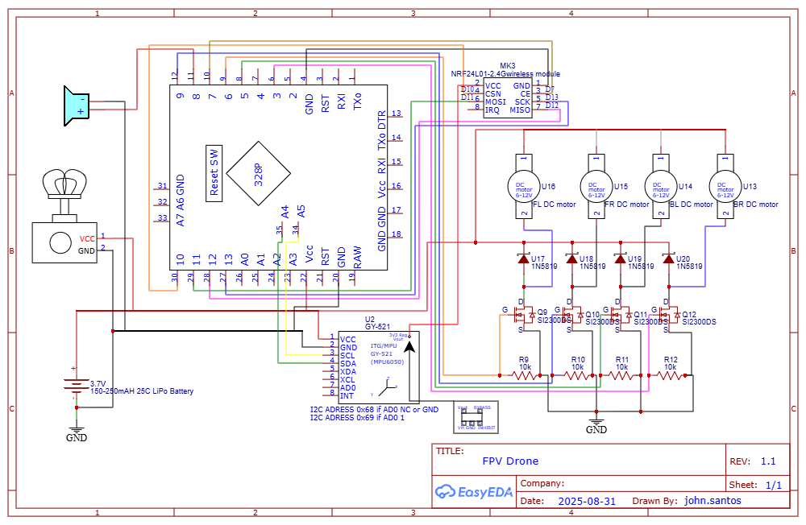

.. _drone_tutorial:

Drone Tutorial
===============

This page will show the step-by-step tutorial for building the NRF24 MultiWii Drone.

Materials
##########

1. Arduino Pro Mini Atmega328P 5V/16MHz (x1)
2. MPU6050 Gyroscope/Accelerometer (x1)
3. NRF24L01+ Transceiver Module (x1)
4. Lilypad 5V Buzzer Speaker (x1)
5. Micro 600TVL FPV Camera with 5.8GHz 25mW Transmitter (x1)
6. 6x15mm 0.8mm Shaft Coreless Motors 19000KV (x4)
7. 1N4148 Surface Mount Diode (x4)
8. S12300DS Surface Mount N-Channel MOSFET (x4)
9. 10KOhm Surface Mount Resistor (x4)
10. 4 Blade 31mm Propellers (x4)
11. LiPO Battery 3.7 220mAH + charger + JST Battery Connector (x1)

Common
---------

1. 30AWG Wires
2. Perforated Board (8x2cm)
3. Copper Sheet
4. Insulation (Kapton Tape or Electrical Tape)
5. Super Glue
6. Carbon Fiber Sheet
7. Mini USB to TTL Serial Converter Adaptor
8. M2 Nylon Hex Spacer Standoff Kit with Male and Female Screw Nut etc.
9. FPV Goggles

Frame
#######

1. Print the cutout blueprint for the drone frame found in `docs/assets/carbon-fiber-blueprint-drone-frame.pdf`.

.. image:: assets/carbon-fiber-blueprint-drone-frame.png
   :width: 300px
   :align: center
   :alt: Drone Frame Cutout

2. Paste the pieces onto the carbon fiber sheet and cut the pieces.

3. The final assembled frame should look like the following.

Electrical
#############

1. Assemble and solder the motor driver on a 3x8 perforated board with the S12300DS Surface Mount N-Channel MOSFETs (x4), 1N4148 Surface Mount Diodes (x4), and 10KOhm Surface Mount Resistors (x4)

2. The assembled motor driver circuit should look like the following.

.. list-table::
   :widths: 50 50
   :header-rows: 0

   * - .. image:: assets/assembled-motor-driver.jpg
         :width: 300px
         :alt: Assembled Motor Driver
     - .. image:: assets/assembled-motor-driver-backside.jpg
         :width: 300px
         :alt: Assembled Motor Driver Backside

3. Solder the MPU6050 and NRF24L01+ Transceiver Module connections to the Arduino Pro Mini as shown in the schematic below.

4. The soldered circuit should look like the following.

.. list-table::
   :widths: 50 50
   :header-rows: 0

   * - .. image:: assets/assembled-drone-communication-circuit.jpg
         :width: 300px
         :alt: Assembled Drone Communication Circuit 
     - .. image:: assets/assembled-drone-communication-circuit-left.jpg
         :width: 300px
         :alt: Assembled Drone Communication Circuit (Left)

5. Solder the motor driver circuit connections to the Arduino Pro Mini. This circuit is stacked below the Arduino Pro Mini. The final module connections such as the buzzer and the camera can also be made in this stage.

.. list-table::
   :widths: 50 50
   :header-rows: 0

   * - .. image:: assets/assembled-drone-circuit.jpg
         :width: 300px
         :alt: Assembled Drone Circuit 
     - .. image:: assets/assembled-drone-circuit-left.jpg
         :width: 300px
         :alt: Assembled Drone Circuit (Left)

Software
##########

1. Open the Arduino IDE and open the project `MultiWii_RF24`.

2. Install the following libraries and include the ZIP libraries in the Arduino IDE.

* `RF24 <https://electronoobs.com/eng_arduino_NRF24_lib.php>`_
* `TimerFreeTone_v1.5 <https://bitbucket.org/teckel12/arduino-timer-free-tone/downloads/TimerFreeTone_v1.5.zip>`_

.. image:: assets/include-libraries.png
   :width: 600px
   :align: center
   :alt: Arduino Include Libraries

3. Adjust the upload settings in Arduino under Tools to set the right board "Arduino Pro or Pro Mini", the COM Port, and the processor to "ATmega328P (5V, 16MHz)".

4. Upload the software to the Arduino. Ensure to reset the Arduino once the programming stage reaches this state.

|

Assembly
##########

The drone assembly should look like the following.

.. list-table::
   :widths: 50 50
   :header-rows: 0

   * - .. image:: assets/drone-exploded-view.jpg
         :width: 300px
         :alt: Exploded View
     - .. image:: assets/drone-assembled.jpg
         :width: 300px
         :alt: Assembled Drone 
