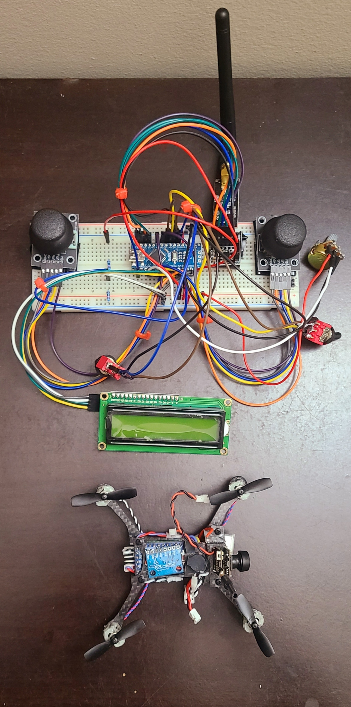
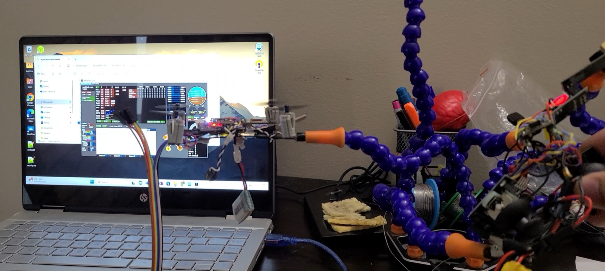
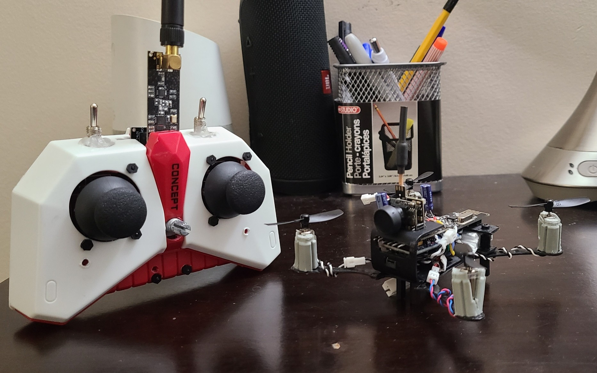
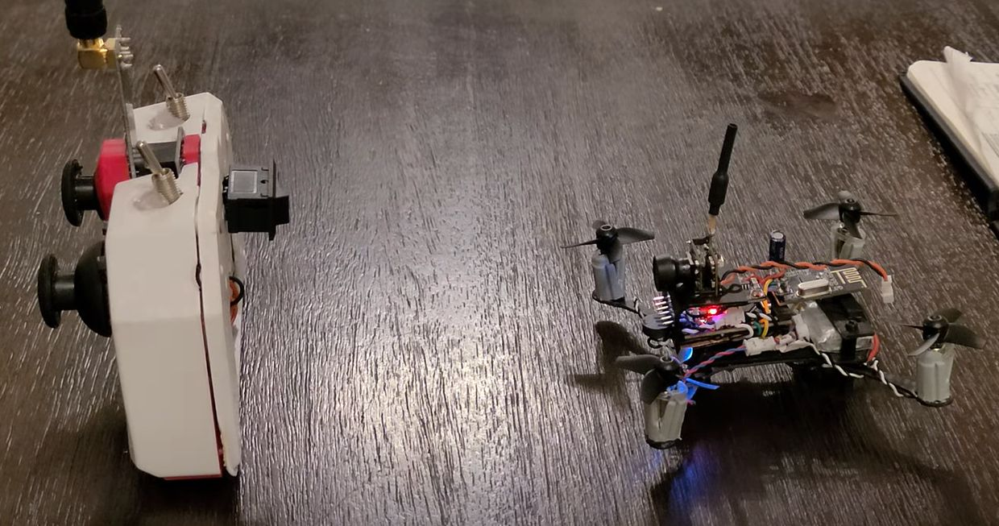
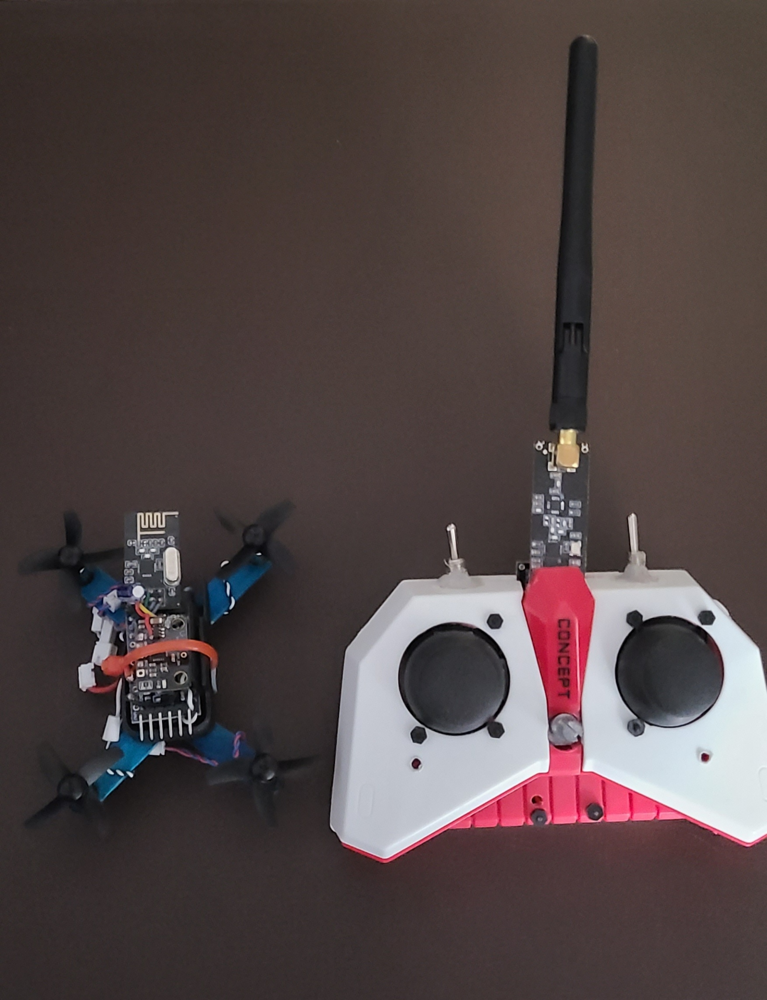
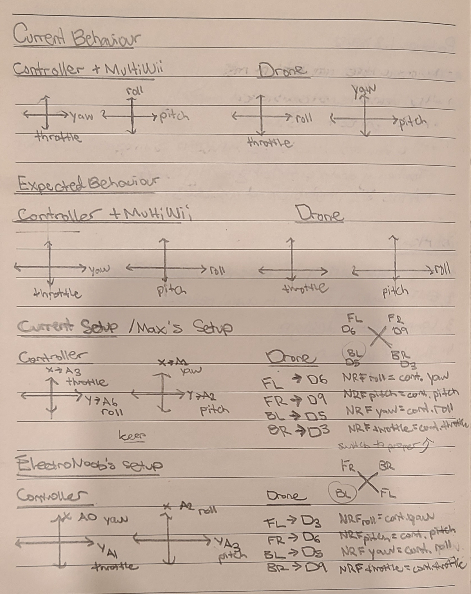
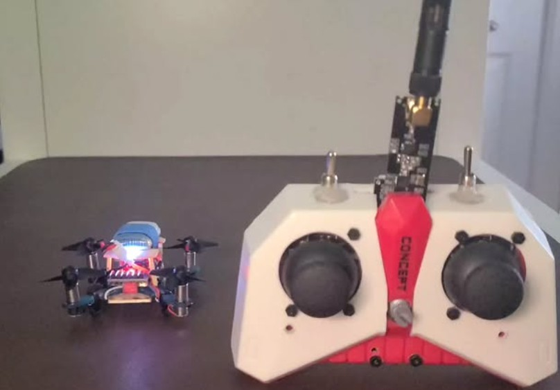
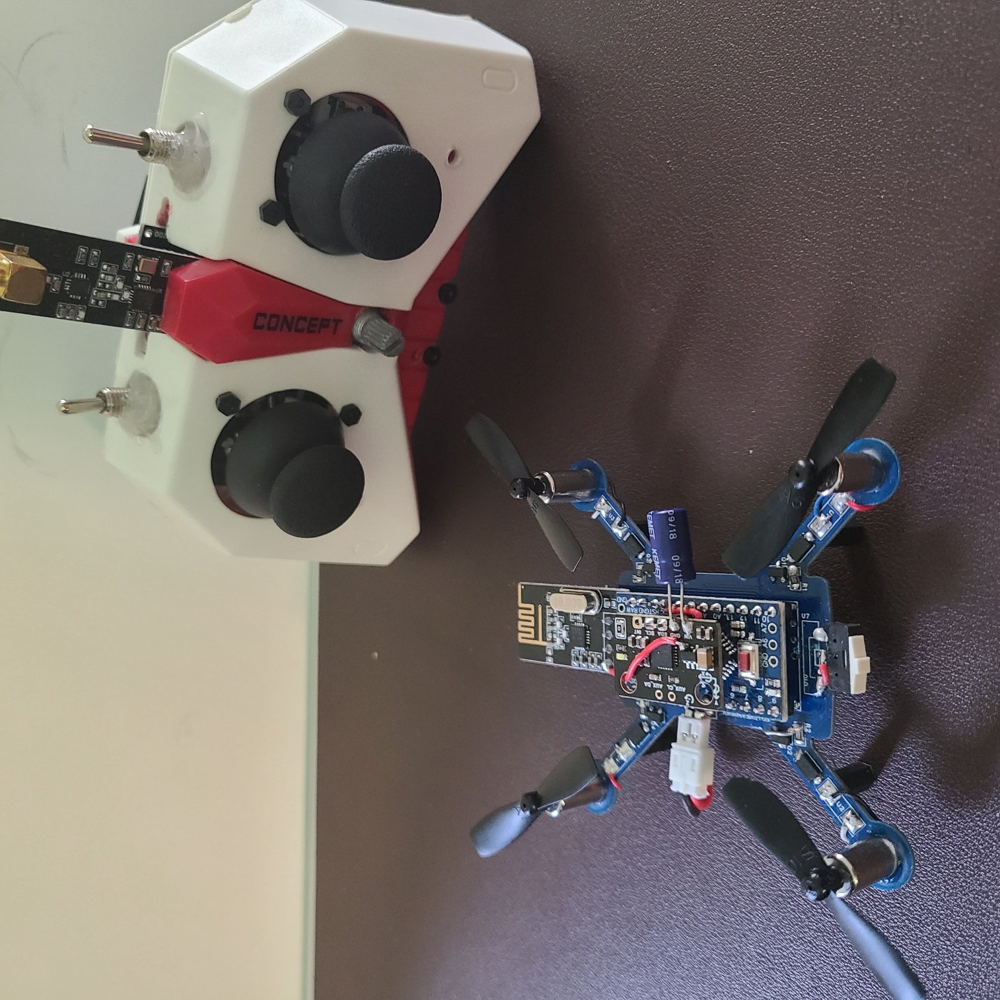

.. _prototypes:

Prototypes
===========

This page will provide an overview of the design of the prototypes 
that will start with the initial prototype and the reasons behind the design changes that lead to the next prototype.

Protoype 1
------------

|

The first protoype is the initial attempt at building the NRF24-MultiWii-Drone. However, there were issues in the design that led to failure. 

**The main issues are listed below:**

1. Too heavy
    - Motor fasteners that were improvised using drywall anchors were too heavy (motors will be glued directly in the next prototype)
    - The wires were too thick using 24AWG
    - The perforated board was too large with lots of unused space
    - The soldered JST connectors (NRF24L01, perforated board, buzzer) are too heavy (these will be removed and wires will be soldered directly in the next prototype)
    - 1N5819 diodes are too heavy (using 1N4148 surface mount diodes in the next prototype)
    - Using velcro is too heavy (use super glue instead)

2. Small Propellers/Less Thrust
    - Using 2 blade (faster) 37mm propellers (use 4 blade propellers for more thrust)

3. Conductive Carbon Fiber Frame
    - Possible short circuits when mounted on the carbon fiber frame (use kapton tape for better insulation with the electrical components)

4. Poor Solder Connections
    - Damaged solder tips (oxidized) resulted in poor solder connections with possible decrease in conductivity and connectivity between components and possible short circuits
    - Replace solder tips and properly resolder the connections in the next prototype

5. Need Soldered Controller with Enclosure
    - The controller uses a breadboard with weak connections and unmanaged wiring. Requires a proper enclosure with soldered connections for better reliability

**Additional materials and replacement needed for the next prototype:**

1. Arduino Pro Mini Atmega 328P 5V/16MHz (un-soldered)
2. MPU6050 from DFRobot (un-soldered)
3. Motor Encoder Circuit
    - Surface mount 1N4148 diodes
    - Solder tips + high quality thin solder 
4. Larger 4 blade propellers
5. Kapton tape for insulation
6. Copper Sheet for proper grounding

Protoype 1.1
------------

|

Protoype 1.1 is the second attempt at building the NRF24-MultiWii-Drone. However, there were still issues in the design that led to failure. 

**The main issues are listed below:**

1. Kapton Tape did not provide proper insulation
    - After adding one layer of kapton tape, it seemed that the electrical components, mainly the IMU shorted and was damaged. This resulted in the accelerometer unable to properly register the movements in MultiSim. The next prototype will include a proper enclosure for the electrical components of the drone. Although the main frame will still be carbon fiber, a separate box enclsoure will be used to cover the electrical components properly using light materials
    - Furthermore, investigating the use of hot glue for proper insulation. However, initial research suggests this may lead to further design failures

2. Controller is Too Complex
    - "Simplicity is the ultimate sophistication." - Leonardo da Vinci 
    - Unnessary components in the controller atleast for the MVP such as the 16x2 LCD to track voltage and the potentiometer should be removed. The controller should be simplified to only include the basic components needed for communicating with the drone and this includes the Arduino Nano controller, the radio module + PA + LNA components, the two joysticks, the two SPDT switches, and the SPST switch with the 3.7V batteries

3. Controller Battery has too much current
    - Prolonged use of the controller lead to overheating of the components and controller failure. Theory is that the battery packs too much current which the components could not handle resulting in breakdown. The two batteries are connected in series are 3.7V 1000mAH. Looking into the use of 3.7V and 600mAH batteries instead

4. Remove the Grounded Copper Sheet
    - This may not be needed as I have not encountered any issues with the drone resetting. This solution was suggested online, but I should not implement solutions to problems that does not exist in my design

**Additional materials and replacement needed for the next prototype:**

1. Arduino Pro Mini Atmega 328P 5V/16MHz (un-soldered)
2. Arduino Nano 
3. Radio Modules NRF24L01 + PA + LNA
4. 3.7V 600mAH batteries (2x)

Prototype 1.2
-------------

|

Prototype 1.2 is the third attempt at building the NRF24-MultiWii-Drone. This prototype addresses the issues found in the previous prototypes and introduces new design elements.
The primary issue in this prototype is that the motors do not respond despite the joystick movements being translated in MulitSim. The drone keeps resetting and attempts to calibrate. 

**The possible issues are listed below:**

1. The battery discharge rate is too low (25C) and that a proper drone battery with a higher discharge rate (30C or higher) is needed
    - Recommended to use "Turnigy Nano-Tech" batteries or similar for their high performance
2. The power for the radio is not consistent and requires a 10uF filtering capacitor at the NRF24 power inputs
3. The power for the Arduino Pro Mini is not consistent and requires a 100uF filtering capacitor
    - Confirm Arduino Pro Mini 3.3V 8MHz, or 5V 16MHz is required
    - Research shows that Arduino Pro Mini 5V 16MHz is recommended to be compatible with MultiSim
4. The power lines has a large AWG (small thickness) where the current cannot be supplied properly
    - Recommended to use solder with lead and keep solder enclosed after use to avoid contamination/oxidation
    - For the motor driver, ensure the proper components are rated for this circuit
    - These components are being used but requires confirmation; 0603 10K SMD resistor 103, SI2300DS-T1-GE3CT-ND N-Channel Mosfet 30V 3.6A, 1N4148 diode surface mount
5. Motor PWM signals could be too weak to drive the motors
    - Requires oscilloscope to confirm suspicion
    - This factor can be set in the MultiWii software, `float adjustmentFactor` on line 1069 of output.cpp
6. Potential EMF noise or leaks is affecting the IMU readings? 
7. The Arduino Pro Mini is faulty which was purchased from "Hutomwua". The previous prototypes was working which was purchased from "Robojax"

**Additional materials and replacement needed for the next prototype:**

1. Arduino Pro Mini Atmega 328P 5V/16MHz (un-soldered) from Robojax specifically

Prototype 1.3
-------------

|

Prototype 1.3 is the fourth attempt at building the NRF24-MultiWii-Drone. This prototype was successful in motor response from the controller movements. 
However, there were still issues where the drone movements were erratic and unstable. There is enough motor throttle to lift the drone, but the drone was unable to
properly lift due to instability and lack of motor synchronization.

**The possible issues are listed below**

1. The drone is not calibrated properly
    - The drone needs to sit on a flat surface for a proper calibration
    - The accelerometer and the gyroscope needs proper calibration
    - Adjust settings in MultiWii configuration with max smoothness
2. Motor direction is wrong
    - This can be verified by feeling if the air is being pushed upwards
    - Record slow motion video to see the direction of the motors
3. The motor RPMs are not the same and unsynchronized
4. The forward direction of the MPU6050 is in the opposite direction
    - Rewire orientation of the motors to have face the MPU6050 in its forward direction
5. The drone is still too heavy and certain weights of the components are not balanced causing the center of gravity to be offset
    - Remove heavy motor mounts and just rely on superglue to attach the motors
6. The arms of the drone are limble which causes wobbling during flight
    - Reinforce the arms with a stronger material that doesn't bend such as popsicle sticks

Prototype 1.4
-------------

|

Prototype 1.4 is the fifth attempt at building the NRF24-MultiWii-Drone. This prototype still could not fly despite the design changes 
to the frame. The motor direction has been corrected; top left => clockwwise, top right => counter-clockwise, bottom left => counter-clockwise, bottom right => clockwise.
The drone motors are now super glued onto the arms and the arms have been converted into popsicle sticks which does not bend easily. Furthermore, the drone has been made smaller,
though it did decrease the overall surface area of the drone, much of the weight has been reduced. Lastly, an EMF blocking shield made of copper has been
attached in the underside of the Arduino Pro Mini to reduce possible interference with the motor controller. PID tuning has also been explored and adjusted,
but still could not find the right values for a stable flight.

**The possible issues are listed below**

1. IMU wobbles, unsecure mount
2. Frame is yet still too heavy
3. Smaller propellers + arm surface area - more unstable
4. Battery is mounted at the bottom which makes it hard to connect
5. Wrong drone output behaviour from the joystick movements - needs software correction
6. Needs PID tuning for the roll, pitch, and yaw

The current configurations with the expected behaviour and the actual behaviour are noted below.

**Design changes for the next prototype**

1. Software correction to the motor behaviour
2. Configure joystick values for correct controller calibration
3. Lighter frame, longer arms, secure mounts
4. Proper PID tuning for the drone's roll, pitch, and yaw

Prototype 1.5
-------------

|

Prototype 1.5 is the sixth attempt at building the NRF24-MultiWii-Drone. This version is still unable to lift off due to major instabilities in 
the flight pattern. For instance, the joystick movements don't seem to match the drone behavior. The drone motors seem to be out of 
sync (PWM signals need to be looked at closely). Furthermore, the drone does keep resetting from time to time. The drone might need PID tuning 
and joystick value adjustments.

**The possible issues are listed below**

1. Motor driver components are too close to the controller (large EMF effects)
2. All power is drawn from the same source connected to the VCC pin of the Arduino Pro Mini
3. Wire thickness used is 28AWG (from 1.25mm connector sockets) - should be 30AWG+
4. The incorrect translation from the controller joystick movements to the drone motor behaviour is causing instability
5. IMU is not sitting flat and unstable
6. Drone motors are not positioned evenly
7. Frame is still too heavy
8. Small surface area drone causing instability

**Design changes for the next prototype**

1. Placement of motor driver components on the arms to disperse combined EMF effects and reduce interference with the controller
2. Power should be directly towards raw pin, VCC, or both?
3. Convert the drone to a PCB to have solid connections between components and reduce the weight from the wires
4. PWM drone pins should be consistent with Electronoobs: FR (D6), BR (D9), BL (D5), FL (D3)

Prototype 2.0
-------------

|

Prototype 2.0 is the seventh attempt at building the NRF24-MultiWii-Drone. This prototype is based on a PCB design using EasyEDA and manufactured by JLCPCB. 
The PCB is designed to be its own frame and has the components soldered directly onto the board. There were component changes to the motor driver based on the following characteristics:

- 10KOhm resistor 0805 (0.125W)   `CRG0805F10K <https://www.digikey.ca/en/products/detail/te-connectivity-passive-product/CRG0805F10K/2380831>`_
    * Ensures VGS = 0
- Diode: `SS54FSH <https://www.digikey.ca/en/products/detail/taiwan-semiconductor-corporation/SS54FSH/18718584>`_ (5A, 40V)
    * Maximum rated current must be greater than 2 * stall current (assuming 2-6A)
- N- Channel Mosfet: `AO3400A <https://www.digikey.ca/en/products/detail/alpha-omega-semiconductor-inc/AO3400A/1855772>`_ or `AO3416 <https://www.digikey.ca/en/products/detail/alpha-omega-semiconductor-inc/AO3416/1855783>`_
    * VDS ~>20-30V is better (rated for high voltage spikes)
    * RDS ~<10mOhm is better (low power loss)
    * Gate threshold ~2.5-3.3V (turns on based on battery capacity)
    * Continuous & Pulsed Current Rating should exceed peak and continuous current draw in drone (5.5A = 25C * 0.22Ah)

The previous components had the following limitations:

- 10KOhm resistor 0603 (0.1W, 2.A max current)
    - Low power and current rating
- 1N5819/1N4148 - Used: 1N4148WS-13-F  (Consider using 1N5819 for low voltage drops)
    - 1N5819: Low voltage drop (~0.3-0.4V)
    - 1N4148: Fast switching, but higher voltage drop (~0.7V)
    - Current rating must be greater than 2 * stall current (2-6A assuming)
- S12300 n-mosfet - Used: SI2300DS-T1-GE3CT-ND

Despite the component changes and the PCB design, the drone still could not lift off and behaves even more poorly. At certain times the current drawn from the back right motor is so high that it is the only motor spinning very fast.
When I disconnect the back right motor, the rest of the motors spins, but then the reset issue persists despite the motor drivers placed at the arms. It seems that dividing the motor driver at the arms does not reduce the EMF effects on 
the Arduino Pro Mini. 

Prototype 2.1
-------------

.. image:: assets/prototype_2.1.jpg
   :width: 300px
   :align: center
   :alt: Prototype 2.1

|

Prototype 2.1 is the eight attempt at building the NRF24-MultiWii-Drone. This prototype is based on the same PCB design as Prototype 2.0, but with component changes to the motor driver and other design changes to address the issues found in Prototype 2.0.
This drone was able to lift off, but the flight is still quite unstable. Here are the design choices that made drastic improvements.

- revert to components 1N4148 Diode, S12300DS n-Mosfet, 10KOhm 0805 resistor
- place copper shield between motor drivers and the Atmega328P/MPU6050 for EMF shielding
- thicker (0.45-0.50mm) power lines, zero 90 degree traces, similar power lengths
- 10uF capacitor at the NRF24L01 power pins
- 100uF capacitor at the MPU6050 power pins
- 3.7V 30C 450mAH battery (minimum 25C)
- consistent motor placement - wiring needs to be at the same start rotation
- Minthrottle is set to 1050 based on the comment description "for brushed ESCs like ladybird"
- larger propellers -> larger surface area -> bigger lift

The importance of capacitors at the power pins:

1. No capacitor -> unable to throttle down (motors keeps spinning) - looks like loss of signal at the NRF24L01 module
2. 10uF capacitor at the NRF24L01 power inputs - motors become out of sync - maybe loss of power at the motor terminals
3. 100uF capacitor at the MPU6050 - only the back left motor is not spinning
4. 100uF capacitor at the microcontroller - no change from previous point
5. 470uF capacitor at the battery terminals - front left and back left motors no longer spin

Turns out problems (3-5) are due to the motors burning out from problem 1 which caused overworking in the motors potentially burning inside components.

The biggest change was remapping the motor designations in the software output.cpp based on the following comparisons to various projects and pin designations.

+-----------+----------------------+---------------------------------+---------------+------+--------------+
| Motor     | Intended Orientation | Max Imagination (Current Setup) | Electronoobs  | Code | Test Results |
+===========+======================+=================================+===============+======+==============+
| Motor[0]  | BR                   | D3                              | D9            | D9   | FR           |
+-----------+----------------------+---------------------------------+---------------+------+--------------+
| Motor[1]  | FR                   | D9                              | D6            | D6   | FL           |
+-----------+----------------------+---------------------------------+---------------+------+--------------+
| Motor[2]  | BL                   | D5                              | D5            | D5   | BL           |
+-----------+----------------------+---------------------------------+---------------+------+--------------+
| Motor[3]  | FL                   | D6                              | D3            | D3   | BR           |
+-----------+----------------------+---------------------------------+---------------+------+--------------+

It seems that the code matches Electronoobs setup. Since I have followed Max Imaginations PWM wirings, I have to modify the software to reflect this wiring. 

Thus the software needs to match the following configuration.

* Motor[0] => FR
* Motor[1] => FL
* Motor[2] => BL
* Motor[3] => BR

So the following lines in output.cpp was modified to:

**Before**

.. code-block:: shell

    motor[0] = PIDMIX(-1,+1,-1); //REAR_R
    motor[1] = PIDMIX(-1,-1,+1); //FRONT_R
    motor[2] = PIDMIX(+1,+1,+1); //REAR_L
    motor[3] = PIDMIX(+1,-1,-1); //FRONT_L

**After**

.. code-block:: shell
    
    motor[0] = PIDMIX(-1,-1,+1); //FRONT_R
    motor[1] = PIDMIX(+1,-1,-1); //FRONT_L
    motor[2] = PIDMIX(+1,+1,+1); //REAR_L
    motor[3] = PIDMIX(-1,+1,-1); //REAR_R

After these changes, I still face issues with poor motor response at the front left motor. Though it spins sometimes and allows the drone to liftoff, it does lose its spin from time to time. 
I will try to make these design changes to improve the response.

1. Reinforce connections with external wiring for the front left motor
2. Experiment with various PID values to see if it improves the motor response and stability of the drone
3. Try to add a capacitor at the NRF24L01 power pins of the controller to see if it improves the signal strength and response of the drone  
