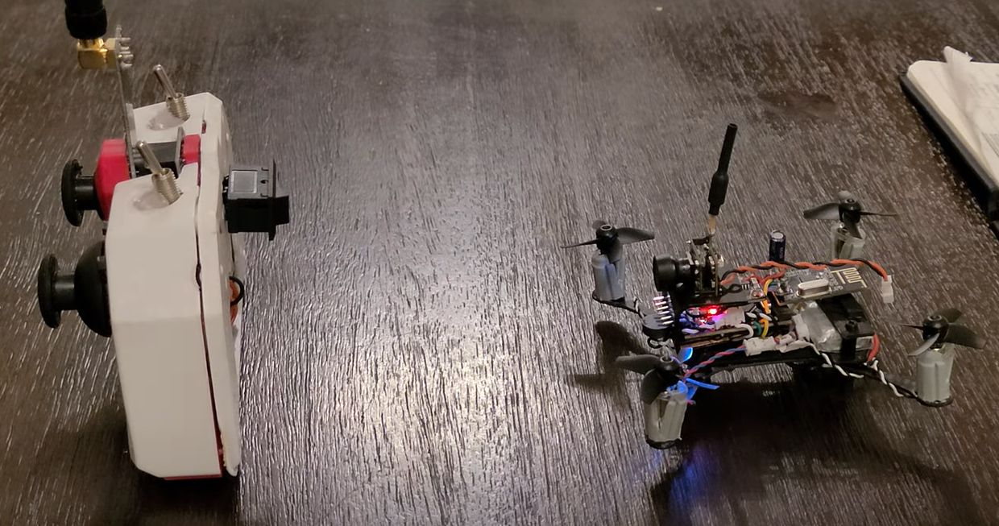

.. _prototypes:

Prototypes
===========

This page will provide an overview of the design of the prototypes 
that will start with the initial prototype and the reasons behind the design changes that lead to the next prototype.

Protoype 1
------------

|

The first protoype is the initial attempt at building the NRF24-MultiWii-Drone. However, there were weaknesses in the design that led to failure. 

**The main issues are listed below:**

1. Too heavy
    - Motor fasteners that were improvised using drywall anchors were too heavy (Motors will be glued directly in the next prototype).
    - The wires were too thick using 24AWG.
    - The perforated board was too large with lots of unused space.
    - The soldered pin connectors (NRF24L01, perforated board, buzzer) are too heavy (These will be removed and wires will be soldered directly in the next prototype).
    - 1N5819 diodes are too heavy (Using 1N4148 surface mount diodes in the next prototype).
    - Using velcro is too heavy (Use super glue instead).

2. Small Propellers/Less Thrust
    - Using 2 blade (faster) 37mm propellers (Use 4 blade propellers for more thrust).

3. Conductive Carbon Fiber Frame
    - Possible short circuits when mounted on the carbon fiber frame (Use kapton tape for better insulation with the electrical components).

4. Poor Solder Connections
    - Damaged solder tips (oxidized) resulted in poor solder connections with possible decrease in conductivity and connectivity between components and possible short circuits.
    - Replace solder tips and properlly resolder the connections in the next prototype.

5. Need Soldered Controller with Enclosure
    - The controller uses a breadboard with weak connections and unmanaged wiring. Requires a proper enclosure with soldered connections for better reliability.

**Additional materials and replacement needed for the next prototype:**

1. Arduino Pro Mini Atmega 328P 5V/16MHz (un-soldered)
2. MPU6050 from DFRobot (un-soldered)
3. Motor Encoder Circuit
    - Surface mount 1N4148 diodes
    - Solder tips + high quality thin solder 
4. Larger 4 blade propellers
5. Kapton tape for insulation
6. Copper Sheet for proper grounding

Protoype 1.1
------------

|

The protoype 1.1 is the second attempt at building the NRF24-MultiWii-Drone. However, there were still weaknesses in the design that led to failure. 

**The main issues are listed below:**

1. Kapton Tape Does not Provide Proper Insulation
    - After adding one layer of kapton tape, it seemed that the electrical components, mainly the IMU shorted and was damaged. This resulted in the gyro unable to properly register the movements in MultiSim. The next prototype will include a proper enclosure for the electrical components of the drone. Although the main frame will still be carbon fiber, a separate box enclsoure will be used to cover the electrical components properly using light materials. 
    - Furthermore, investigating the user of hot glue for proper insulation. However, initial research suggests this may lead to further design failures.

2. Controller is Too Complex
    - "Simplicity is the ultimate sophistication." - Leonardo da Vinci 
    - Unnessary components in the controller atleast for the MVP such as the 16x2 LCD to track voltage and the potentiometer should be removed. The controller should be simplified to only include the basic components for communicating with the drone and this includes the Arduino Nano controller, the radio module + PA + LNA components, the two joysticks, the two SPDT switches, and the SPST switch with the 3.7V batteries. 

3. Controller Battery Has Too Much Current
    - Prolonged use of the controller lead to overheating of the components and controller failure. Theory is that the battery packs too much current which the components could not handle resulting in breakdown. The two batteries are connected in parallel which are 3.7V 1000mAH. Looking into the use of 3.7V and 600mAH batteries instead. 

4. Remove the Grounded Copper Sheet
    - This may not be needed as I have not encountered any issues with the drone resetting. This solution was suggested online, but I should not implement solutions to problems that does not exist in my design.

**Additional materials and replacement needed for the next prototype:**

1. Arduino Pro Mini Atmega 328P 5V/16MHz (un-soldered)
2. Arduino Nano 
3. Radio Modules NRF24L01 + PA + LNA
4. 3.7V 600mAH batteries (2x)

Prototype 1.2
-------------

|

The prototype 1.2 is the third attempt at building the NRF24-MultiWii-Drone. This prototype addresses the issues found in the previous prototypes and introduces new design elements.
The primary issue in this prototype is that the motors do not respond despire the joystick movements being correctly translated in MulitSim. The drone keeps resetting and attempts to calibrate. 

**The possible issues are listed below:**

1. The battery discharge rate is too low (25C) and that a proper drone battery with a higher discharge rate (30C or higher) is needed.
    - Recommended to use "Turnigy Nano-Tech" batteries or similar for their high performance.
2. The power for the radio is not consistent and requires a 10uF filtering capacitor at the NRF24 power inputs. 
3. The power for the Arduino Pro Mini is not consistent and requires a 100uF filtering capacitor. 
    - Confirm Arduino Pro Mini 3.3V 8MHz, or 5V 16MHz is required. 
    - Research shows that Arduino Pro Mini 5V 16MHz is recommended to be compatible with MultiSim. 
4. The power lines has a large AWG (small thickness) where the current cannot be supplied properly.
    - Recommended to use solder with lead and keep solder enclosed after use to avoid contamination/oxidation.
    - For the motor driver, ensure the proper components are rated for this circuit. These components are being used but requires confirmation.
    - 0603 10K SMD resistor 103, SI2300DS-T1-GE3CT-ND N-Channel Mosfet 30V 3.6A, IN4148 diode surface mount. 
5. Motor PWM signals could be too weak to drive the motors. 
    - Requires oscilloscope to confirm suspicion.
    - This factor can be set in the MultiWii software, `float adjustmentFactor` on line 1069 of output.cpp.
6. Potential EMF noise or leaks is affecting the IMU readings? 
7. The Arduino Pro Mini is faulty which was purchased from "Hutomwua". The previous prototypes was working which was purchased from "Robojax".

**Additional materials and replacement needed for the next prototype:**

1. Arduino Pro Mini Atmega 328P 5V/16MHz (un-soldered) from Robojax specifically. 

Prototype 1.3
-------------

|

The prototype 1.3 is the fourth attempt at building the NRF24-MultiWii-Drone. This prototype was successful in motor response from the controller movements. 
However, there were still issues where the drone movements were erratic and unstable. There is enough motor throttle to lift the drone, but the drone was unable to
properly lift due to instability and lack of motor synchronization.

**The possible issues are listed below**

1. The drone is not calibrated properly.
    - The drone needs to sit on a flat surface for a proper calibration.
    - The accelerometer and the gyroscope needs proper calibration.
    - Adjust settings in MultiWii configuration with max smoothness.
2. Motor direction is wrong.
    - This can be verified by feeling if the air is being pushed upwards.
    - Record slow motion video to see the direction of the motors.
3. The motor RPMs are not the same and unsynchronized.
4. The forward direction of the MPU6050 is in the opposite direction. 
    - Rewire orientation of the motors to have face the MPU6050 in its forward direction.
5. The drone is still too heavy and certain weights of the components are not balanced causing the center of gravity to be offset.
    - Remove heavy motor mounts and just rely on superglue to attach the motors.
